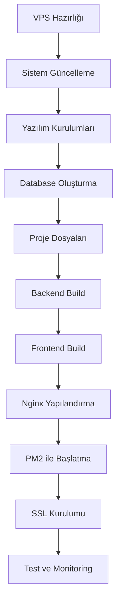

# 🚀 CampScape Deployment Dosyaları

Bu dizinde Hostinger VPS'e Ubuntu ile deployment yapmak için gerekli tüm dosyalar bulunmaktadır.

## 📁 Dosya Yapısı

### 📘 Rehber Dosyaları

| Dosya | Açıklama | Ne Zaman Kullanılır |
|-------|----------|---------------------|
| **`HIZLI_BASLANGIC.md`** | ⚡ 10 dakikalık hızlı başlangıç | İlk önce buraya bakın! |
| **`UBUNTU_DEPLOY_GUIDE.md`** | 📖 Detaylı adım adım rehber | Sorun çıkarsa veya manuel kurulum |
| **`HOSTINGER_NOTLAR.md`** | 📝 Hostinger'a özel bilgiler | Hostinger VPS kullanıyorsanız |
| **`DEPLOYMENT_README.md`** | 📚 Bu dosya - genel bakış | Hangi dosyaya bakacağınızı öğrenin |

### 🔧 Script Dosyaları

| Dosya | Açıklama | Kullanım |
|-------|----------|----------|
| **`ubuntu-quick-deploy.sh`** | 🤖 Otomatik kurulum scripti | **ÖNERİLEN** - Tek komutla deployment |
| `deploy.sh` | 📦 Manuel build scripti | Geliştirme için |
| `docker-deploy.sh` | 🐳 Docker deployment | Docker kullanmak isterseniz |

### 📄 Config Dosyaları

| Dosya | Açıklama |
|-------|----------|
| `nginx.conf` | Nginx yapılandırması |
| `docker-compose.yml` | Docker compose dosyası |
| `docker-compose.prod.yml` | Production Docker config |
| `Dockerfile` | Frontend Docker image |
| `server/Dockerfile` | Backend Docker image |

---

## 🎯 Hızlı Başlangıç

### Yöntem 1: Otomatik Kurulum (ÖNERİLEN) ⭐

**En kolay ve hızlı yöntem!**

```bash
# 1. VPS'e bağlan
ssh root@your-server-ip

# 2. Dosyaları yükle (Git/FTP/SCP ile)
cd /var/www/campscape

# 3. Otomatik kurulum scriptini çalıştır
chmod +x ubuntu-quick-deploy.sh
./ubuntu-quick-deploy.sh
```

**Süre:** ~10-15 dakika  
**Detaylar:** `HIZLI_BASLANGIC.md`

---

### Yöntem 2: Manuel Kurulum

Eğer otomatik script sorun çıkarırsa:

**Detaylı rehber:** `UBUNTU_DEPLOY_GUIDE.md`

---

### Yöntem 3: Docker ile Kurulum

```bash
# Docker ve Docker Compose kur
sudo apt install -y docker.io docker-compose

# Script'i çalıştır
chmod +x docker-deploy.sh
./docker-deploy.sh
```

---

## 📖 Okuma Sırası

### 1️⃣ İlk Deployment (Yeni Kullanıcılar)

```
1. HIZLI_BASLANGIC.md         ← Buradan başlayın
2. ubuntu-quick-deploy.sh     ← Script'i çalıştırın
3. HOSTINGER_NOTLAR.md        ← Hostinger'a özel bilgiler
```

### 2️⃣ Sorun Giderme

```
1. UBUNTU_DEPLOY_GUIDE.md → Bölüm 12: Sorun Giderme
2. HOSTINGER_NOTLAR.md → Yaygın Sorunlar ve Çözümleri
```

### 3️⃣ Manuel Kurulum Gerekiyorsa

```
1. UBUNTU_DEPLOY_GUIDE.md → Tüm bölümler
2. server/BACKEND_SETUP.md → Backend detayları
```

### 4️⃣ Güncelleme (Update)

```
1. UBUNTU_DEPLOY_GUIDE.md → Güncelleme Prosedürü
2. HOSTINGER_NOTLAR.md → Backup Stratejisi
```

---

## 🔍 Hangi Dosyaya Bakmalıyım?

### Soruna Göre Dosya Seçimi

#### "Hiçbir şey bilmiyorum, sıfırdan kurulum yapacağım"
→ **`HIZLI_BASLANGIC.md`**

#### "Hostinger VPS kullanıyorum, özel bilgiler var mı?"
→ **`HOSTINGER_NOTLAR.md`**

#### "Otomatik script çalışmadı, manuel kuracağım"
→ **`UBUNTU_DEPLOY_GUIDE.md`**

#### "Backend başlamıyor, 500 hatası alıyorum"
→ **`UBUNTU_DEPLOY_GUIDE.md`** → Bölüm 12.1

#### "Frontend 404 hatası veriyor"
→ **`UBUNTU_DEPLOY_GUIDE.md`** → Bölüm 12.2

#### "API 502 Bad Gateway veriyor"
→ **`UBUNTU_DEPLOY_GUIDE.md`** → Bölüm 12.3

#### "Database'e bağlanamıyorum"
→ **`UBUNTU_DEPLOY_GUIDE.md`** → Bölüm 12.4

#### "SSL sertifikası nasıl kurulur?"
→ **`UBUNTU_DEPLOY_GUIDE.md`** → Bölüm 9

#### "Domain nasıl bağlanır?"
→ **`HOSTINGER_NOTLAR.md`** → Domain Ayarları

#### "Backup nasıl alınır?"
→ **`HOSTINGER_NOTLAR.md`** → Backup Stratejisi

#### "Performans nasıl optimize edilir?"
→ **`HOSTINGER_NOTLAR.md`** → Performans Optimizasyonu

---

## 🚨 Önemli Notlar

### ⚠️ Deployment Öncesi

- [ ] Hostinger VPS hazır (Ubuntu 20.04/22.04 LTS)
- [ ] SSH erişimi var
- [ ] Domain adı var ve DNS ayarları yapılacak
- [ ] Güçlü şifreler hazırladınız (database, JWT secret)

### ⚠️ Deployment Sonrası

- [ ] Admin şifresini değiştirin (admin@campscape.com / Admin123!)
- [ ] Database backup ayarlayın
- [ ] SSL sertifikası kuruldu
- [ ] Firewall yapılandırıldı
- [ ] Monitoring aktif

### ⚠️ Güvenlik

- [ ] Varsayılan admin şifresini mutlaka değiştirin
- [ ] JWT_SECRET'ı güçlü yapın (64+ karakter)
- [ ] Database şifresini güçlü yapın
- [ ] Firewall aktif
- [ ] SSL sertifikası kurulu
- [ ] Düzenli güncellemeler yapın

---

## 📊 Deployment Süreci Özet



**Otomatik Script ile:** Tüm bu adımlar otomatik!

---

## 🛠️ Script Kullanımı Detayları

### `ubuntu-quick-deploy.sh`

**Özellikler:**
- ✅ Sistem güncellemesi
- ✅ Node.js, MySQL, Nginx, PM2 kurulumu
- ✅ Firewall yapılandırması
- ✅ Database oluşturma
- ✅ Backend ve Frontend build
- ✅ Nginx config
- ✅ PM2 ile başlatma
- ✅ SSL kurulumu (opsiyonel)

**Kullanım:**

```bash
# Önce executable yap
chmod +x ubuntu-quick-deploy.sh

# Çalıştır
./ubuntu-quick-deploy.sh

# Script size soracak:
# - Domain adınız
# - MySQL root şifresi
# - Database kullanıcı şifresi
# - Admin email
```

**Not:** Windows'ta çalıştırmayın! VPS'te (Ubuntu) çalıştırın.

---

### `deploy.sh`

Manuel build için:

```bash
chmod +x deploy.sh
./deploy.sh
```

Backend ve frontend'i build eder, migration çalıştırır.

---

### `docker-deploy.sh`

Docker kullanmak isterseniz:

```bash
chmod +x docker-deploy.sh
./docker-deploy.sh
```

---

## 📚 Ek Dokümantasyon

### Backend Dokümantasyonu

```
server/
  ├── README.md              → Backend genel bakış
  ├── BACKEND_SETUP.md       → Backend kurulum
  ├── QUICKSTART.md          → Hızlı başlangıç
  └── API_DOCUMENTATION.md   → API referansı
```

### Frontend Dokümantasyonu

```
src/
  └── (React components)
```

---

## 🔗 Faydalı Linkler

### Hostinger

- **hPanel:** https://hpanel.hostinger.com
- **VPS Tutorials:** https://www.hostinger.com/tutorials/vps
- **Support:** Ticket veya Live Chat

### Teknoloji Dokümantasyonu

- **Ubuntu:** https://ubuntu.com/server/docs
- **Node.js:** https://nodejs.org/docs/
- **MySQL:** https://dev.mysql.com/doc/
- **Nginx:** https://nginx.org/en/docs/
- **PM2:** https://pm2.keymetrics.io/docs/
- **Let's Encrypt:** https://letsencrypt.org/docs/

---

## 🎓 Deployment Adımları (Detaylı)

### Başlangıç Seviye (Yeni Kullanıcılar)

1. **VPS Satın Alın**
   - Hostinger > VPS > KVM 1 veya KVM 2
   - Ubuntu 22.04 seçin

2. **Domain Ayarlayın**
   - A kaydı: @ → VPS IP
   - A kaydı: www → VPS IP

3. **SSH ile Bağlanın**
   ```bash
   ssh root@your-vps-ip
   ```

4. **Dosyaları Yükleyin**
   - FileZilla ile SFTP
   - Veya Git ile clone

5. **Script'i Çalıştırın**
   ```bash
   cd /var/www/campscape
   chmod +x ubuntu-quick-deploy.sh
   ./ubuntu-quick-deploy.sh
   ```

6. **Tamamdır!**
   - Website: https://yourdomain.com
   - Admin: admin@campscape.com / Admin123!

---

### Orta Seviye (Deneyimli Kullanıcılar)

Manuel kurulum yapabilirsiniz:

**Rehber:** `UBUNTU_DEPLOY_GUIDE.md`

---

### İleri Seviye (DevOps)

- Docker deployment
- Kubernetes
- CI/CD pipeline
- Load balancing
- Horizontal scaling

---

## 📞 Destek

### Sorununuz mu var?

1. **İlk önce logları kontrol edin:**
   ```bash
   pm2 logs campscape-backend
   sudo tail -f /var/log/nginx/campscape-error.log
   ```

2. **Sorun Giderme bölümlerine bakın:**
   - `UBUNTU_DEPLOY_GUIDE.md` → Bölüm 12
   - `HOSTINGER_NOTLAR.md` → Yaygın Sorunlar

3. **Health check yapın:**
   ```bash
   curl http://localhost:3000/health
   ```

---

## ✅ Deployment Checklist

Deployment tamamlandıktan sonra:

### Backend

- [ ] Backend çalışıyor: `curl http://localhost:3000/health`
- [ ] PM2'de aktif: `pm2 list`
- [ ] Database bağlantısı OK
- [ ] Migrations çalıştı
- [ ] Seed data yüklendi
- [ ] Upload dizini var ve yazılabilir
- [ ] Logs yazılıyor

### Frontend

- [ ] Frontend görünüyor: `https://yourdomain.com`
- [ ] Static files serve ediliyor
- [ ] SPA routing çalışıyor (sayfa yenileme)
- [ ] Assets yükleniyor
- [ ] API çağrıları çalışıyor

### Nginx

- [ ] Config test OK: `sudo nginx -t`
- [ ] HTTPS çalışıyor
- [ ] HTTP → HTTPS redirect
- [ ] Gzip compression aktif
- [ ] API proxy çalışıyor

### Security

- [ ] SSL sertifikası kurulu
- [ ] Firewall aktif
- [ ] Admin şifresi değiştirildi
- [ ] JWT secret güçlü
- [ ] Database şifresi güçlü

### Monitoring

- [ ] PM2 monitoring
- [ ] Nginx logs
- [ ] Backend logs
- [ ] Error tracking

### Backup

- [ ] Database backup scripti
- [ ] Otomatik backup (cron)
- [ ] Upload files backup

---

## 🎉 Başarıyla Tamamlandı!

Tebrikler! CampScape uygulamanız artık production'da çalışıyor.

**Website:** https://yourdomain.com  
**Admin Panel:** https://yourdomain.com/admin/login  
**API:** https://yourdomain.com/api

---

## 📅 Bakım ve Güncelleme

### Düzenli Bakım

**Günlük:**
- Log dosyalarını kontrol edin
- Disk alanını kontrol edin
- Uptime'ı kontrol edin

**Haftalık:**
- Backup'ları kontrol edin
- Performance metrics
- Error logs analizi

**Aylık:**
- Sistem güncellemeleri: `sudo apt update && sudo apt upgrade`
- SSL sertifikası kontrolü
- Security audit

### Güncelleme Prosedürü

```bash
# 1. Backup alın
cd /var/www/campscape
mysqldump -u campscape_user -p campscape_marketplace > backup.sql

# 2. Güncellemeleri çekin
git pull origin main

# 3. Backend güncelle
cd server
npm install
npm run build
pm2 restart campscape-backend

# 4. Frontend güncelle
cd ..
npm install
npm run build
sudo cp -r dist/* /var/www/campscape/frontend/

# 5. Migration (gerekirse)
cd server
npm run db:migrate

# 6. Test edin
curl http://localhost:3000/health
curl https://yourdomain.com
```

---

**Hazırlayan:** CampScape Dev Team  
**Platform:** Hostinger VPS  
**OS:** Ubuntu 22.04 LTS  
**Versiyon:** 1.0  
**Son Güncelleme:** Kasım 2025

**🚀 İyi kullanımlar!**


